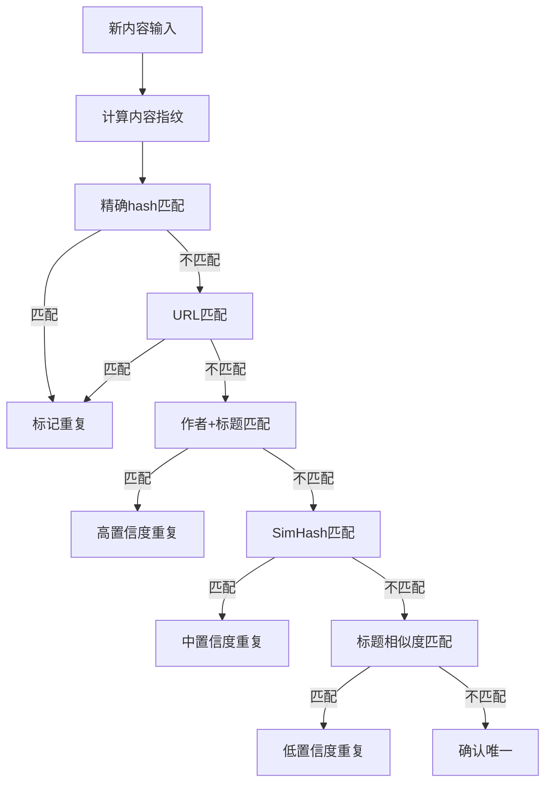
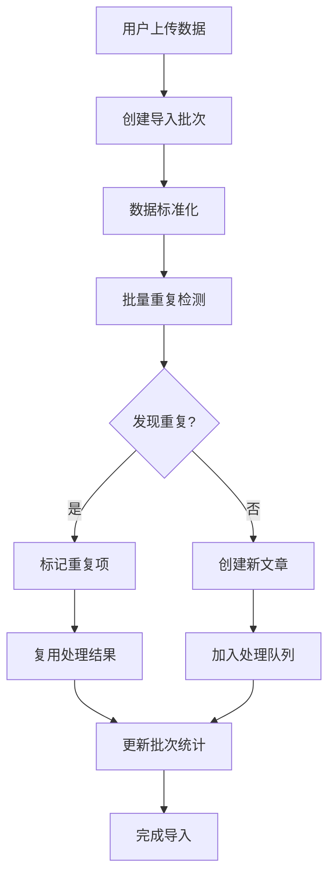

# 重复检测和复用机制设计文档

## 概述

本文档详细描述了AI趋势总结项目中的重复检测和处理结果复用机制，解决多种数据获取方式下的重复问题和处理效率问题。

## 核心设计理念

### 1. 多维度重复检测
- **精确匹配**: 基于内容hash的完全重复检测
- **模糊匹配**: 基于标题、作者等字段的相似度检测  
- **语义匹配**: 基于SimHash的近似重复检测
- **结构化匹配**: 基于URL、作者+标题组合的匹配

### 2. 智能复用策略
- **完全复用**: 相同内容的处理结果直接复用
- **部分复用**: 高相似度内容的选择性复用
- **置信度调整**: 根据相似度调整复用结果的置信度

### 3. 渐进式处理
- **阶段化处理**: 将业务处理分解为多个独立阶段
- **依赖管理**: 明确阶段间的依赖关系
- **状态跟踪**: 完整的处理状态记录和监控

## 重复检测机制

### 内容指纹系统

```sql
-- 多维度指纹
CREATE TABLE content_fingerprints (
    content_hash VARCHAR(64),      -- 全文SHA256
    title_hash VARCHAR(64),        -- 标题hash
    url_hash VARCHAR(64),          -- URL标准化hash
    semantic_hash VARCHAR(64),     -- 语义hash
    simhash BIGINT,               -- SimHash近似匹配
    minhash JSONB                 -- MinHash Jaccard相似度
);
```

### 检测策略优先级

1. **精确内容匹配** (优先级: 最高)
   - 基于content_hash的完全匹配
   - 置信度: 100%
   - 处理策略: 标记为重复，复用所有处理结果

2. **URL匹配** (优先级: 高)
   - 相同URL视为同一内容
   - 置信度: 100%
   - 处理策略: 标记为重复

3. **作者+标题组合匹配** (优先级: 中高)
   - 相同作者 + 高度相似标题
   - 置信度: 70%-95%
   - 处理策略: 人工审核或自动处理

4. **SimHash近似匹配** (优先级: 中)
   - 汉明距离 ≤ 3 视为高度相似
   - 置信度: 60%-90%
   - 处理策略: 部分复用处理结果

5. **标题相似度匹配** (优先级: 低)
   - 相似度 ≥ 0.8 视为可能重复
   - 置信度: 50%-80%
   - 处理策略: 人工审核

### 检测流程



## 处理结果复用机制

### 复用策略

#### 1. 完全复用 (Full Copy)
- **适用场景**: 内容完全相同 (content_hash匹配)
- **复用范围**: 所有已完成的处理阶段
- **置信度**: 保持原始置信度
- **实现**: 直接复制processing_status和相关业务数据

#### 2. 部分复用 (Partial Copy)  
- **适用场景**: 高度相似内容 (相似度 ≥ 0.8)
- **复用范围**: 选择性复用稳定的处理阶段
- **置信度**: 原始置信度 × 相似度系数
- **实现**: 复用concepts_extracted, classified等阶段

#### 3. 引用复用 (Reference Only)
- **适用场景**: 中度相似内容 (相似度 0.6-0.8)
- **复用范围**: 仅复用处理状态，不复用具体数据
- **置信度**: 降低到0.5-0.7
- **实现**: 标记为已处理，但需要重新验证

### 可复用的处理阶段

| 阶段 | 复用条件 | 复用策略 | 置信度调整 |
|------|----------|----------|------------|
| `concepts_extracted` | 相似度 ≥ 0.8 | 复用概念，调整相关性分数 | × 相似度 |
| `classified` | 相似度 ≥ 0.7 | 复用分类，调整置信度 | × 相似度 |
| `summarized` | 相似度 ≥ 0.9 | 复用摘要 | × 相似度 |
| `quality_assessed` | 相似度 ≥ 0.8 | 复用质量评分 | × 相似度 |
| `relations_extracted` | 相似度 ≥ 0.9 | 复用关系数据 | × 相似度 |

## 用户导入特殊处理

### 导入流程



### 导入重复检测特点

1. **批量处理**: 一次性检测整个批次的重复情况
2. **用户选择**: 允许用户选择如何处理重复项
3. **增量导入**: 支持用户多次导入，避免重复处理
4. **质量验证**: 对用户导入的数据进行质量检查

### 导入配置示例

```json
{
  "deduplication_config": {
    "enabled": true,
    "strategies": ["content_hash", "title_similarity", "url_match"],
    "thresholds": {
      "title_similarity": 0.8,
      "content_similarity": 0.9
    },
    "auto_merge": false,
    "require_user_confirmation": true
  },
  "processing_config": {
    "auto_process": true,
    "skip_stages": [],
    "priority": 3
  }
}
```

## 性能优化

### 索引策略

```sql
-- 重复检测优化索引
CREATE INDEX idx_fingerprints_content_hash ON content_fingerprints(content_hash);
CREATE INDEX idx_fingerprints_simhash ON content_fingerprints(simhash);
CREATE INDEX idx_articles_fingerprint ON articles(fingerprint_id);

-- 复用查询优化索引  
CREATE INDEX idx_processing_status_article_stage ON processing_status(article_id, stage);
CREATE INDEX idx_duplicate_results_similarity ON duplicate_detection_results(similarity_score DESC);
```

### 缓存策略

1. **指纹缓存**: 将常用的content_hash缓存到Redis
2. **相似度缓存**: 缓存计算过的相似度结果
3. **处理结果缓存**: 缓存可复用的处理结果

### 异步处理

1. **重复检测队列**: 异步执行重复检测任务
2. **复用任务队列**: 异步执行结果复用任务
3. **批量处理**: 批量处理用户导入的重复检测

## 监控和统计

### 关键指标

1. **重复检测率**: 每日/每周的重复检测比例
2. **复用成功率**: 处理结果复用的成功比例  
3. **处理时间节省**: 通过复用节省的处理时间
4. **用户导入质量**: 用户导入数据的重复率和质量分布

### 监控查询

```sql
-- 重复检测效果
SELECT * FROM v_deduplication_stats 
WHERE date >= CURRENT_DATE - INTERVAL '7 days';

-- 复用效果统计
SELECT * FROM v_reuse_stats
WHERE date >= CURRENT_DATE - INTERVAL '7 days';
```

## 使用示例

### 1. 检测新文章重复

```sql
-- 检测单篇文章
SELECT * FROM comprehensive_duplicate_detection(
    'abc123...', -- content_hash
    'GPT-4的新突破', -- title  
    12345678, -- simhash
    '张三', -- author
    'https://example.com/article1' -- url
);
```

### 2. 复用处理结果

```sql
-- 查找可复用的结果
SELECT * FROM find_reusable_processing_results(123);

-- 执行复用
SELECT reuse_processing_results(
    456, -- source_article_id
    123, -- target_article_id
    ARRAY['concepts_extracted', 'classified'], -- stages
    'partial_copy' -- strategy
);
```

### 3. 批量处理用户导入

```sql
-- 检测导入批次的重复
SELECT * FROM batch_detect_import_duplicates('batch_20250127_001');
```

## 扩展建议

1. **机器学习增强**: 使用ML模型提升相似度检测准确性
2. **语义向量**: 集成向量数据库进行语义相似度检测
3. **用户反馈**: 收集用户对重复检测结果的反馈，持续优化
4. **A/B测试**: 对不同的检测策略进行A/B测试
5. **实时流处理**: 支持实时数据流的重复检测